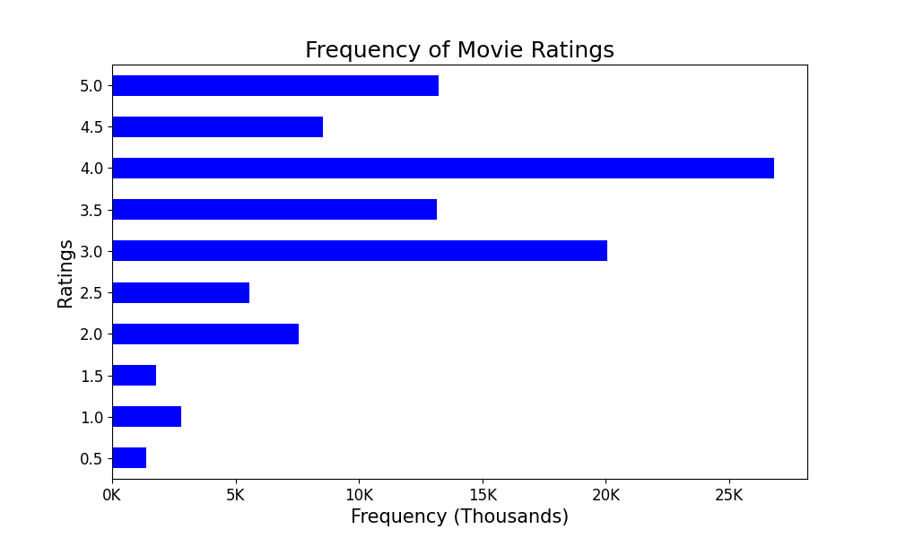
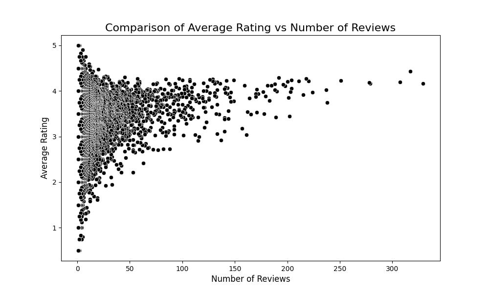
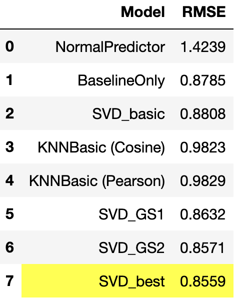
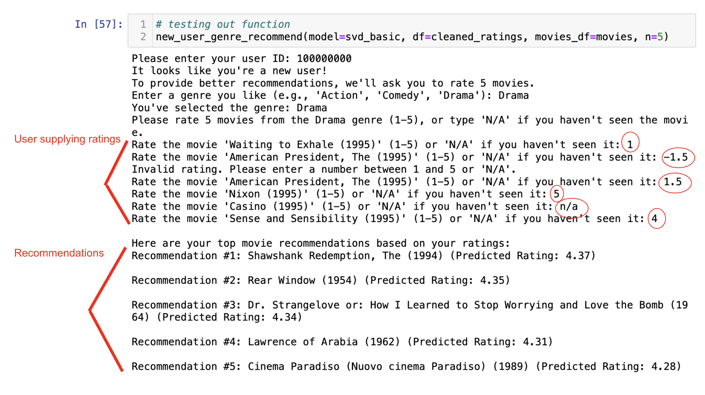

# Movie Recommendation System
Author: Chris Kucewicz

## Business Understanding

### Background

The Kanopy app is a movie streaming service widely used by public libraries and universities, offering a vast library of films, documentaries, educational content, and more. While Kanopy has a dedicated user base, it faces challenges in competing with larger, more popular streaming platforms like Netflix and Hulu. One key factor contributing to this challenge is that Kanopy does not currently ask or require users to rate movies. As a result, the platform lacks the kind of personalized content recommendations that are a hallmark of other streaming services. By implementing a collaborative filtering recommendation system that leverages user ratings and the ratings of similar users, Kanopy can provide more tailored movie suggestions. This approach will help users discover new content, boost engagement, and increase user retention. 

### Business Goals
The primary goal of this project is to develop and implement a personalized movie recommendation system model for the Kanopy app. Using collaborative filtering techniques, the system will provide users with top 5 movie recommendations based on the ratings of similar users and the user’s own past ratings and viewing history.

### Business Success Criteria
The success of this project will be evaluated based on the accuracy and relevance of the movie recommendations generated by the system. Specifically, the system will aim to provide each user with a list of their top 5 recommended movies tailored to their preferences.

To measure the effectiveness of the recommendations, the project will use Root Mean Square Error (RMSE) as the primary evaluation metric. RMSE quantifies the difference between the predicted ratings and the actual user ratings for movies. A lower RMSE indicates better predictive accuracy, meaning the recommendations align more closely with user preferences.

Achieving a competitive RMSE score will demonstrate that the recommendation system is capable of delivering meaningful and personalized suggestions. This, in turn, is expected to enhance user satisfaction, increase engagement with the platform, and boost user retention—key factors in Kanopy’s ability to compete in the crowded streaming market.

## Data Understanding
This project used data from MovieLens’ database, specifically focusing on two datasets: `movies.csv` and `ratings.csv`.

`movies.csv`: This dataset contains over 9,000 observations, with each row representing a unique movie identified by a movieId. Additional information about each movie includes its title (which includes the year of release in parentheses) and its associated genres (Action, Comedy, Drama, etc.)

`ratings.csv`: This dataset provides detailed information on user ratings, with over 100,000 observations. Each row represents a single rating provided by a user for a specific movie. Key fields include userId (an identifier for the user), movieId (linking the rating to a movie in the `movies.csv` dataset), rating (0-5 stars with 0.5 increments), and timestamp (indicating when the rating was made).

### Data Preparation
The `movies` and `ratings` dataframes were well-structured, requiring minimal data preparation. There were no issues with null values, incorrect datatypes, or the need to rename features, so the data preparation phase was relatively short. The main steps involved merging the two datasets using an inner join, which helped facilitate a more comprehensive Exploratory Data Analysis (EDA) by combining relevant information from both. Additionally, the `timestamp` feature was removed from the merged dataset, as it does not contribute to the functionality of the recommender system or the EDA.
Lastly, I dropped `timestamp` from `ratings` so `ratings` was prepared for use in the Surprise models. 

## Exploratory Data Analysis
Key findings:
* There is a ***weak, positive*** correlation (**0.1273**) between a movie’s number of ratings and overall rating, indicating that popular movies tend to receive slightly higher ratings.
* The three most popular movies by number of reviews are *Forrest Gump*, *Shawshank Redemption*, and *Pulp Fiction*.
* By average rating, the *Film-Noir* genre is the highest rated (**3.92**), while *Horror* movies are the lowest rated (**3.28**).

## Modeling
The goal of the modeling phase was to train an effective model for a recommender system using the Surprise package, which is designed for building and implementing such systems.

For this project, I selected collaborative filtering (CF) over content-based filtering because collaborative filtering excels in identifying patterns in sparse matrices and scales more effectively. This scalability makes it better suited for Kanopy’s growing user base.

**Pipeline Development**

* I built a custom pipeline to streamline the modeling process. The pipeline processes datasets containing userId, movieId, and rating, splits them into an 80/20 train-test split, trains models, predicts ratings, and computes RMSE. RMSE, a standard metric in recommender systems, quantifies prediction errors as the distance between actual and predicted values. A smaller RMSE indicates better performance.

**Baseline Models**

* To establish benchmarks, I implemented two baseline models:
NormalPredictor (RMSE: 1.4212): Generates random predictions based on a normal distribution.
BaselineOnly (RMSE: 0.8637): Uses user and item biases for predictions.
These models provide a quick and robust reference for evaluating performance improvements.

**Advanced Models** 
1. Singular Value Decomposition (SVD)
    * RMSE: 0.8714
    * Chosen for its ability to efficiently handle sparse datasets, outperforming sklearn’s version.
2. KNNBasic
    * Implemented with cosine similarity (RMSE: 0.978) and Pearson correlation (RMSE: 0.974).
    * User-user filtering was applied due to the smaller number of users (601) compared to movies (9724), optimizing computational efficiency.

SVD outperformed KNNBasic, leading to its selection for hyperparameter tuning.

**Hyperparameter Tuning**

* SVD was optimized using `GridSearchCV` in two rounds, testing the parameters `n_factors`, `n_epochs`, `lr_all`, and `reg_all`. Three cross-folds were used to balance computational efficiency and robust evaluation, and RMSE was calculated for each iteration to assess improvements.

**Addressing the Cold Start Problem**

* A common issue for recommender systems, including Kanopy’s, is the cold start problem, as the platform does not collect user ratings. This can be particularly challenging for collaborative filtering systems due to the lack of user information. In Section 6: Evaluation, I outline a method to address this challenge.
## Evaluation
The final model, optimized through hyperparameter tuning, achieved the lowest RMSE score of **0.8559**, outperforming all baseline and advanced models. It demonstrated an improvement of approximately *0.0200* over the best baseline model (BaselineOnly, RMSE: **0.8785**), making it the preferred model for the recommender system.

While CF models, particularly SVD, excel at identifying patterns in sparse datasets and effectively scale with larger user bases, they face challenges with the cold start problem. This problem stems from their reliance on existing user data to generate recommendations, making it difficult to provide accurate predictions for new users or items. Therefore, while I expect this optimized SVD model to perform well as Kanopy’s ratings database expands, its effectiveness may be limited during the early stages of database development.

To address this cold start issue, I designed recommendation functions that incorporate strategies to generate meaningful suggestions for new users. These solutions are elaborated on in the following sections.
### Recommendation Systems
With the best model and tuned hyperparameters, I created 3 functions for this recommender system.
1. Basic Recommender (`basic_recommender()`): This function generates a list of the user’s top 5 recommended movies.

2.	Cold Start Recommender for New Users (`new_user_genre_recommend()`): This function builds on the `basic_recommender()` by asking users for their userID and preferred genre. Users then rate 5 random movies they’ve seen, and the function implements these ratings to provide a curated list of top 5 movie recommendations.

3.	Initial Ratings Collection Function (`user_rating_collection`): Specifically for the early stages of the system’s deployment, this function simply prompts users to rate 5 movies without offering recommendations. This helps Kanopy build its ratings database as it grows.
## Conclusion

### Limitations
While the approach used in this project is effective in many scenarios, there are several limitations that should be acknowledged:
1. **RMSE as an Evaluation Metric**:
* By using RMSE (Root Mean Square Error) as the evaluation metric, I treated this recommendation problem like a regression problem. However, this poses a limitation because the ratings data, ranging from 0.5 to 5.0, is ordinal in nature. Ordinal data represents categories with a defined order, but the numerical differences between these ratings do not necessarily reflect equal intervals. As a result, RMSE may not fully capture the nuances of ordinal data, where the distance between ratings such as 3 and 4 might not be the same as the distance between 4 and 5. Typically, ordinal data would be treated differently to avoid making assumptions about the spacing between ratings.
2. **Cold Start Problem**:
* A significant limitation in using collaborative filtering for recommendations is the cold start problem, which occurs when there is insufficient user data to make meaningful predictions. In the case of Kanopy, where users do not rate movies, this becomes a major issue. Collaborative filtering relies heavily on the ratings data from users to generate recommendations, and when new users or movies enter the system without sufficient ratings, it becomes difficult to make personalized recommendations. This is especially problematic in platforms like Kanopy that don’t actively collect user ratings.
3. **Time Limitations**:
* Building a comprehensive user rating database from scratch is a time-consuming process. Since the model relies on user ratings to generate recommendations, gathering enough ratings to make accurate predictions for all users and movies can take a significant amount of time. Without a substantial amount of user interaction, the model’s ability to make accurate and personalized recommendations will be limited, which could hinder its effectiveness during the early stages of deployment.
### Recommendations
1.	**Begin Collecting User Ratings**
* Kanopy should begin by utilizing the simple user ratings function (`user_rating_collection()`) that was created in this project. This will allow users to rate movies they have watched, gradually building a robust ratings database. Collecting user ratings is crucial for feeding collaborative filtering algorithms and ensuring that the system can offer personalized recommendations over time.
2.	**Implement the Recommender System After Sufficient Data Collection**
* Once the ratings database has reached a sufficient size—perhaps after a few weeks of actively requesting ratings from users—the recommender system function (`new_user_genre_recommend()`) can be implemented. This would allow Kanopy to start generating movie recommendations based on the collected ratings. With a larger database, the system can begin making more accurate predictions, enhancing the overall user experience.
3.	**Explore Additional Solutions to the Cold Start Problem**
* Given that Kanopy faces a cold start problem due to the lack of user ratings, it’s important to explore additional solutions. Potential approaches could include:
  
    * Content-based Filtering: In the absence of sufficient user ratings, a content-based filtering approach could be used, where movies are recommended based on their attributes (e.g., genre, director, cast) and a user’s preferences.
      
    * Implicit Feedback: Instead of requiring explicit ratings, Kanopy could leverage implicit data, such as tracking which movies users watch, viewing durations, or repeat views. These behaviors can serve as proxies for user preferences. For example:
        - Users who watch multiple movies in a particular genre could be recommended similar titles.
        - Analyzing incomplete views might help avoid recommending movies users abandoned early.
      
    * Hybrid Models: Combining collaborative filtering with content-based filtering can mitigate the cold start problem. This hybrid approach can offer more relevant recommendations, especially for new users or movies with limited ratings.
### Next Steps
1. **Explore Additional Models within Surprise**
* SVD++: An enhanced version of SVD that incorporates implicit feedback, improving predictions with sparse ratings.

2.	**Address the Cold Start Problem with Clustering**
* K-Means Clustering: Cluster users or movies based on similarity to make recommendations for new users.
* HAC (Hierarchical Agglomerative Clustering): Group users or items hierarchically to recommend based on similar clusters.
## Additional Information

View the full project in the Jupyter Notebook. 
  
Contact Chris Kucewicz at cfkucewicz@gmail.com with additional questions.

## Repository Structure
